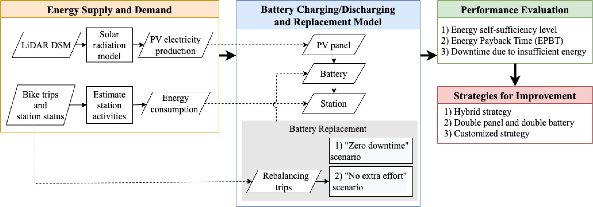
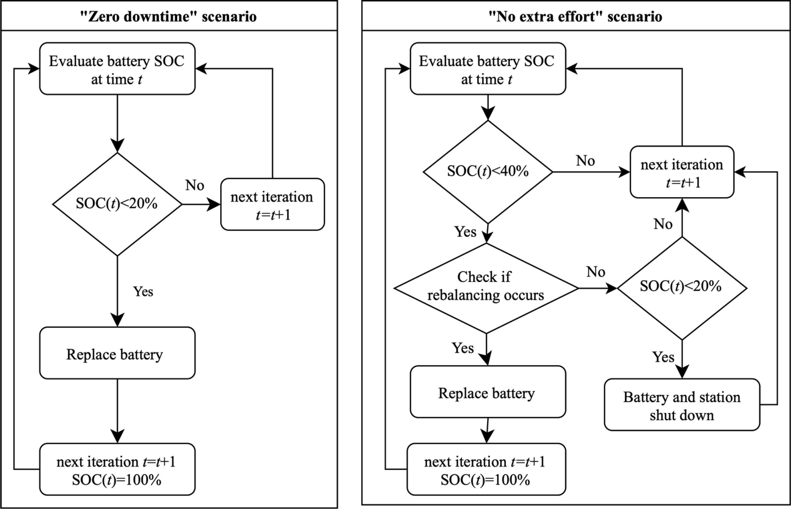
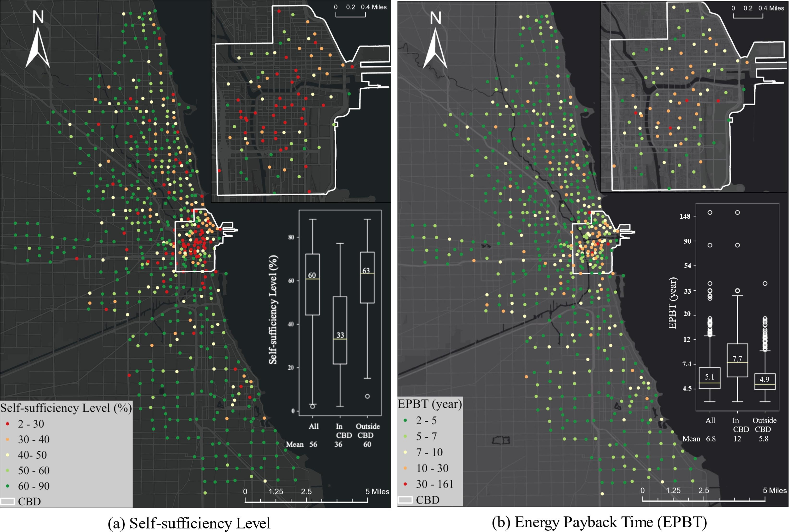
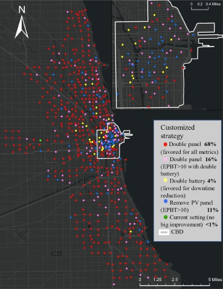

# Bike Share Solar Energy Self-Sufficiency Analysis

This repository contains the code associated with the research paper **"Photovoltaic-battery powered bike share stations are not necessarily energy self-sufficient"** published in [Applied Energy](https://www.sciencedirect.com/science/article/pii/S0306261923008693?via=ihub).

## Abstract

Many cities use solar photovoltaic (PV) panels to power off-grid bike share stations to provide sustainable transportation. When a station's energy demand for operating the station's kiosk and docks exceeds the PV panel's supply, the battery can be depleted, requiring manual battery replacement to avoid service disruption. However, existing research on siting, modeling, or assessing the environmental impacts of bike share stations has not accounted for spatially variable solar PV potential and energy usage. This study addresses this gap to analyze the performances of PV-battery systems for bike share stations and evaluates strategies to improve their energy independence, sustainability, and system reliability. Using Chicago's Divvy bike share system as a case study, we simulated the battery charging, discharging, and replacements, and measured their performances with three metrics: energy self-sufficiency level, energy payback time (EPBT), and station downtime. We found that PV energy alone is insufficient to meet all energy needs of bike share stations, with the average energy self-sufficiency levels being 56%. Additionally, relying solely on battery replacement during rebalancing operations was insufficient to maintain stations' operational status. On average, bike share operators need to manually replace a station's batteries 72 times a year. Furthermore, the current PV panels for most stations are sized too small. Increasing panel sizes could reduce most stations' downtime and increase their self-sufficiency without significantly affecting EPBT. The study highlights the need for bike share system modeling and operation planning to account for battery replacement needs and demonstrates the importance to evaluate smaller yet large-scale street-level PV applications. The modeling framework presented in this study can also be extended to examine other smaller PV-battery systems similar to bike stations.


## Key Findings

- **Energy Self-Sufficiency**: Average energy self-sufficiency levels of 56% across bike share stations
- **Battery Replacements**: Operators need to manually replace station batteries an average of 72 times per year
- **PV Panel Sizing**: Current PV panels are undersized for most stations
- **System Reliability**: Battery replacement during rebalancing alone is insufficient to maintain operational status

## Methodology

### Modeling Framework

*Overview of the simulation methodology and system components*

### Energy Demand Calculation (`calcDemand.py`)
- Processes Divvy bike share trip data and station status data for 2019
- Calculates hourly energy consumption

### Solar PV Production (`calcPV.py`)
- Calculates PV electricity production from solar radiation data
- Generates hourly PV production profiles for all stations

### Battery Simulation Models


*Simulation scenarios*

#### Zero Downtime Scenario (`BatterySimulationAllStation1W.py`)
- Simulates battery charging/discharging with immediate replacement when depleted
- Maximizes self-consumption of PV energy
- Battery stops discharging at 20% capacity (cutout point)
- Tracks battery replacements and energy flows

#### Rebalancing Scenario (`BatterySimulationAllStation1W_rebalancing.py`)
- Considers battery replacement only during scheduled rebalancing operations
- Battery replacement threshold at 40% capacity during rebalancing
- Accounts for station downtime when battery is depleted
- More realistic operational scenario

### Performance Metrics
1. **Energy Self-Sufficiency Level (SSL)**: Percentage of energy demand met by PV
2. **Energy Payback Time (EPBT)**: Time to recover embodied energy of PV-battery system
3. **Station Downtime**: Percentage of time stations are non-operational


## Results and Visualizations


### We found station location, i.e. whether it is in the shadow of nearby buildings, is critical for self-sufficiency level


*Animation showing solar radiation patterns in downtown Chicago*


Stations were not energy self-sufficient with an average level of 56%
With an average of 6.8 years, most stations’ energy payback time were within their lifespan of 10 years



Stations in CBD would benefit from customized strategy

*Stations in CBD would benefit from customized strategy*


## Citation

If you use this code or data in your research, please cite:

```bibtex
@article{bike_share_solar_2023,
  title={Bike Share Solar Energy Self-Sufficiency},
  journal={Applied Energy},
  volume={},
  pages={},
  year={2023},
  doi={https://doi.org/10.1016/j.apenergy.2023.121234}
}

